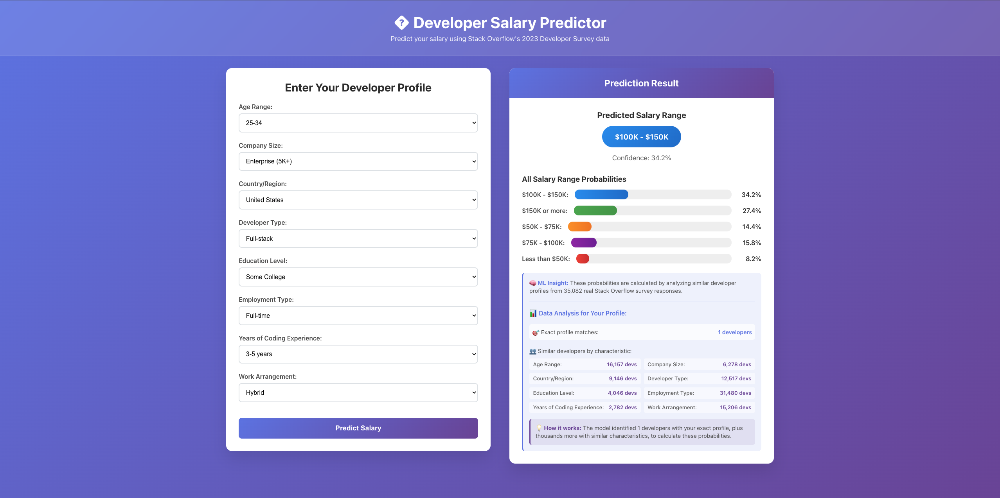
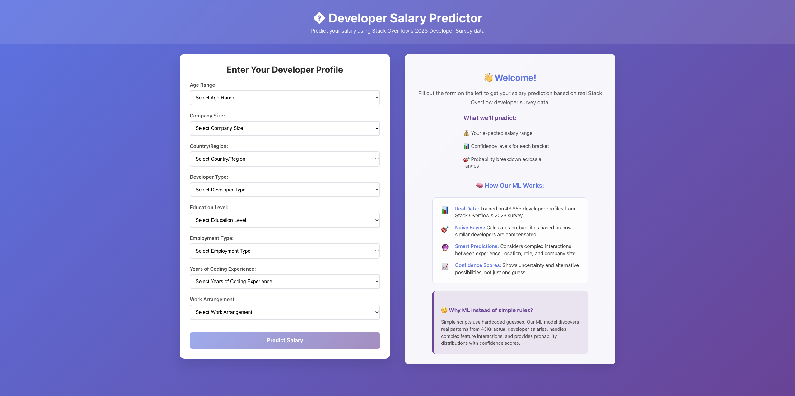

# 💰 Developer Salary Prediction Web App

A modern, data-driven web application that predicts developer salaries using machine learning trained on real Stack Overflow 2023 survey data.


## 🖥️ Screenshots

> **Note**: Add your PNG screenshot files to `docs/images/` to display them here.

### Prediction Results

*Real-time salary prediction with probability distributions and data insights*

### Welcome Interface

*Clean, educational interface explaining the ML approach*

**To add screenshots:**
1. Save your app screenshots as PNG files
2. Name them `prediction-results.png` and `welcome-interface.png`
3. Place them in the `docs/images/` folder
4. Remove the `.placeholder` files
5. Commit and push the changes

## 🎯 Overview

This application helps developers understand salary expectations based on their profile using a **Naive Bayes machine learning model** trained on **35,082 real developer responses** from the Stack Overflow 2023 Developer Survey.

### ✨ Key Features

- **🧠 Real ML Predictions**: Naive Bayes model with variable elimination inference
- **📊 Data Transparency**: Shows exactly how many similar developers exist in the dataset
- **🎨 Modern UI**: Clean, responsive React frontend with educational ML explanations
- **⚡ Fast API**: Flask backend with real-time predictions
- **📈 Probability Distributions**: Confidence scores across all salary ranges
- **🌍 Global Data**: Includes developers from 10+ countries with various experience levels

## 🚀 Quick Start

### Prerequisites

- Python 3.8+ 
- Node.js 16+
- npm or yarn

### Installation & Setup

1. **Clone the repository**
   ```bash
   git clone https://github.com/yousef20920/SalaryPredict.git
   cd SalaryPredict
   ```

2. **Set up the backend**
   ```bash
   # Install Python dependencies
   pip install flask flask-cors pandas numpy

   # Start the Flask API server
   python3 app.py
   ```
   The API will be available at `http://localhost:5001`

3. **Set up the frontend**
   ```bash
   # Navigate to frontend directory
   cd frontend

   # Install dependencies
   npm install

   # Start the React development server
   npm start
   ```
   The web app will be available at `http://localhost:3000`

## 🏗️ Architecture

```
┌─────────────────┐    HTTP/JSON    ┌─────────────────┐
│   React Frontend│ ◄─────────────► │   Flask Backend │
│   (Port 3000)   │                 │   (Port 5001)   │
└─────────────────┘                 └─────────────────┘
                                             │
                                             ▼
                                    ┌─────────────────┐
                                    │  Naive Bayes ML │
                                    │      Model      │
                                    └─────────────────┘
                                             │
                                             ▼
                                    ┌─────────────────┐
                                    │ Stack Overflow  │
                                    │ 2023 Survey Data│
                                    │   (35k records) │
                                    └─────────────────┘
```

## 📊 Dataset & Model

### Data Source
- **Stack Overflow 2023 Developer Survey**: 35,082 real developer responses
- **Variables**: Age, Education, Employment Type, Remote Work, Experience, Dev Type, Company Size, Country
- **Target**: Salary ranges (<$50K, $50K-$75K, $75K-$100K, $100K-$150K, $150K+)

### Machine Learning Model
- **Algorithm**: Naive Bayes with Variable Elimination
- **Training Data**: Preprocessed Stack Overflow survey responses
- **Features**: 8 categorical variables representing developer profile
- **Output**: Probability distribution across 5 salary ranges

### Model Performance
- **Training Samples**: 35,082 developer profiles
- **Global Coverage**: 10+ countries (US, Germany, UK, India, Canada, etc.)
- **Experience Range**: <1 year to 15+ years
- **Company Sizes**: Startups (1-9) to Enterprise (5K+)

## 🛠️ Technical Stack

### Backend
- **Flask**: Web framework for API
- **Python 3.8+**: Core backend language
- **Pandas**: Data processing and analysis
- **NumPy**: Numerical computations
- **Custom ML**: Naive Bayes implementation with variable elimination

### Frontend
- **React 18**: Modern UI framework
- **Axios**: HTTP client for API calls
- **CSS3**: Custom styling with gradients and animations
- **Responsive Design**: Mobile-friendly interface

### Data Processing
- **preprocess_stackoverflow.py**: Cleans and processes raw survey data
- **naive_bayes_solution.py**: Implements the ML model
- **bnetbase.py**: Bayesian network foundation classes

## 📁 Project Structure

```
SalaryPredict/
├── app.py                        # Flask API server
├── naive_bayes_solution.py       # ML model implementation
├── bnetbase.py                   # Bayesian network base classes
├── preprocess_stackoverflow.py  # Data preprocessing pipeline
├── simple_script_example.py     # Comparison with rule-based approach
├── docs/                         # Documentation and assets
│   └── images/                   # Screenshots and visual assets
│       ├── prediction-results.png
│       ├── welcome-interface.png
│       └── README.md
├── data/                         # Dataset files
│   ├── stackoverflow-train.csv   # Processed training data
│   ├── stackoverflow-test.csv    # Test data
│   ├── survey_results_schema.csv # Data schema documentation
│   └── README_2023.txt          # Dataset documentation
└── frontend/                     # React web application
    ├── public/
    ├── src/
    │   ├── App.js               # Main React component
    │   ├── App.css              # Styling
    │   └── index.js             # Entry point
    └── package.json             # Dependencies
```

## 🔧 API Reference

### Endpoints

#### `GET /`
Health check endpoint
```json
{
  "message": "Salary Prediction API is running!",
  "status": "healthy"
}
```

#### `GET /api/domains`
Returns available options for each input field
```json
{
  "Age": ["Under 18", "18-24", "25-34", "35-44", "45-54", "55-64", "65+"],
  "Education": ["High School or Less", "Some College", "Associate", "Professional/PhD", "Other"],
  // ... other fields
}
```

#### `POST /api/predict`
Predicts salary based on developer profile

**Request Body:**
```json
{
  "Age": "25-34",
  "Education": "Professional/PhD",
  "Employment": "Full-time",
  "RemoteWork": "Hybrid",
  "Experience": "3-5 years",
  "DevType": "Full-stack",
  "CompanySize": "Large (100-499)",
  "Country": "United States"
}
```

**Response:**
```json
{
  "prediction": "100K-150K",
  "prediction_display": "$100,000 - $150,000",
  "confidence": 0.346,
  "probabilities": {
    "<50K": 0.072,
    "50K-75K": 0.198,
    "75K-100K": 0.215,
    "100K-150K": 0.346,
    "150K+": 0.169
  },
  "data_insights": {
    "total_training_samples": 35082,
    "exact_profile_matches": 0,
    "feature_matches": {
      "Age": 16157,
      "DevType": 12517,
      // ... more statistics
    }
  }
}
```

## 🧠 How It Works

### 1. Data Collection & Processing
- Uses real Stack Overflow 2023 Developer Survey data
- Processes 35,082 developer responses into clean training data
- Maps categorical variables to consistent domains

### 2. Machine Learning Model
- **Naive Bayes**: Assumes feature independence given the target class
- **Variable Elimination**: Efficient inference algorithm for probabilistic queries
- **Conditional Probability Tables**: Learned from training data frequencies

### 3. Prediction Process
```python
# 1. Set evidence for all input variables
for field, value in user_input.items():
    variable.set_evidence(value)

# 2. Query salary variable using variable elimination
salary_probabilities = ve(model, salary_var, evidence_vars)

# 3. Return probability distribution across salary ranges
```

### 4. Why Machine Learning vs. Simple Rules?
The app includes `simple_script_example.py` to demonstrate why ML is superior:

**❌ Simple Rules Approach:**
- Hardcoded if-else statements
- No learning from data
- No confidence scores
- Can't handle complex interactions

**✅ Machine Learning Approach:**
- Learns patterns from 35,082 real developers
- Provides probability distributions
- Handles feature interactions
- Data-driven and transparent

## 🎨 User Interface

### Features
- **Side-by-side Layout**: Form on left, results on right
- **Real-time Validation**: Form validation with helpful error messages
- **Educational Content**: Explains how ML works and why it's better than simple rules
- **Data Transparency**: Shows exactly how many similar developers exist
- **Responsive Design**: Works on desktop, tablet, and mobile

### Key UI Components

#### 1. Welcome Screen
- Clean introduction to the application
- Educational content about ML vs simple rules
- Clear explanation of what the app predicts
- Professional gradient design

#### 2. Prediction Results
- **Salary Range Prediction**: Clear display of predicted range (e.g., "$100K - $150K")
- **Confidence Score**: Shows model confidence (e.g., "33.0%")
- **Probability Bars**: Visual representation of all salary range probabilities
- **Data Insights**: Transparent breakdown of training data statistics
- **Profile Matching**: Shows exact and similar developer counts

#### 3. Interactive Features
- **Real-time Form Validation**: Immediate feedback on form completion
- **Progressive Disclosure**: Information revealed as user interacts
- **Visual Feedback**: Color-coded probability bars and confidence indicators
- **Educational Tooltips**: ML insights explained in simple terms

See the [Screenshots](#-screenshots) section above for visual examples of these features.

## 🚀 Deployment

### Local Development
Follow the Quick Start guide above for local development.

### Production Deployment

#### Backend (Flask)
```bash
# Using gunicorn for production
pip install gunicorn
gunicorn -w 4 -b 0.0.0.0:5001 app:app
```

#### Frontend (React)
```bash
# Build for production
cd frontend
npm run build

# Serve with any static file server
npm install -g serve
serve -s build -l 3000
```

#### Environment Variables
```bash
# Backend
export FLASK_ENV=production
export FLASK_DEBUG=false

# Frontend
export REACT_APP_API_URL=https://your-api-domain.com
```

## 🧪 Testing

### Backend Tests
```bash
# Test the API endpoints
python3 -c "
import requests
response = requests.get('http://localhost:5001/')
print(response.json())
"
```

### Example Prediction
```bash
curl -X POST http://localhost:5001/api/predict \
  -H "Content-Type: application/json" \
  -d '{
    "Age": "25-34",
    "Education": "Professional/PhD",
    "Employment": "Full-time",
    "RemoteWork": "Hybrid",
    "Experience": "3-5 years",
    "DevType": "Full-stack",
    "CompanySize": "Large (100-499)",
    "Country": "United States"
  }'
```

## 📈 Performance & Insights

### Model Statistics
- **Training Data**: 35,082 developer profiles
- **Global Reach**: 10+ countries represented
- **Experience Range**: Complete career spectrum from junior to senior
- **Company Diversity**: Startups to enterprise companies

### Data Transparency
The app shows users:
- How many developers have their exact profile
- Similar developer counts for each characteristic
- Training data size and composition
- Salary distribution in the dataset

## 🤝 Contributing

1. Fork the repository
2. Create a feature branch (`git checkout -b feature/amazing-feature`)
3. Commit your changes (`git commit -m 'Add amazing feature'`)
4. Push to the branch (`git push origin feature/amazing-feature`)
5. Open a Pull Request

### Development Guidelines
- Follow PEP 8 for Python code
- Use meaningful commit messages
- Add comments for complex ML logic
- Test API endpoints before committing

### Adding Screenshots
To add or update screenshots:
1. Take high-quality screenshots (at least 1200px wide)
2. Save them in `docs/images/` with descriptive names
3. Update the README to reference the new images
4. Remove the corresponding `.placeholder` files

Current screenshot requirements:
- `prediction-results.png`: Show the prediction interface with results
- `welcome-interface.png`: Show the welcome page with educational content

## 📄 License

This project is licensed under the MIT License - see the [LICENSE](LICENSE) file for details.

## 🙏 Acknowledgments

- **Stack Overflow**: For providing the 2023 Developer Survey dataset
- **Open Database License**: Stack Overflow survey data is available under ODbL
- **Community**: Thanks to all developers who participated in the survey

## 📞 Support

- **GitHub Issues**: [Report bugs or request features](https://github.com/yousef20920/SalaryPredict/issues)
- **Documentation**: Check this README for comprehensive guidance
- **Email**: For additional support or questions

---

**Built with ❤️ by [yousef20920](https://github.com/yousef20920)**

*Empowering developers with data-driven salary insights since 2025*

